# Operationalizing ML in Azure

## Table of contents
* [Overview](#Overview)
* [Architectural Diagram](#Architectural-Diagram)
* [Key Steps](#Key-Steps)
* [Screen Recording](#Screen-Recording)
* [Future work](#Future-work)
* [References](#References)


## Overview
In this project, we build and deploy an ML model in Azure ML studio and then consume the model using the REST API endpoint. Two approaches were implemented for developing and deploying the ML model, the first approach involved building a model using AutoML, and then deploy the best model. Once the model was deployed, it was consumed with the help of Swagger UI using the REST API endpoint and the primary key genrated for the deployed model. The second approach followed the same steps but it was performed using the Python SDK in [Jupyter Notebook](aml-pipelines-with-automated-machine-learning-step.ipynb). The steps taken in both approaches and the results are discussed below.
<br>
The dataset provided contains data related to a direct marketing campaign for a bank. This is a binary classification problem with the goal to predict if a client will subsrcibe a term deposit or not. However, the goal of this project is to get familiar with deployment and consuming the ML model rather than focsuing on building the most accurate model for the classification task. There are 20 features (columns) in total which includes customers age, job, maritual...etc. and the target column "y" which is a "Yes" or "No". The original dataset can be found [here](https://archive.ics.uci.edu/ml/datasets/bank+marketing).

## Architectural Diagram
*TODO*: Provide an architectual diagram of the project and give an introduction of each step. An architectural diagram is an image that helps visualize the flow of operations from start to finish. In this case, it has to be related to the completed project, with its various stages that are critical to the overall flow. For example, one stage for managing models could be "using Automated ML to determine the best model". 


## Key Steps
### **Authentication**
Since the lab provided was through Udacity VM, this step was not performed. However, when working on our own Azure credentials, this is a very critical step. Authentication is required to prevent  the interruption of the CI/CD flow. There are three types of Authentication:
1. Key-based:
* Azure Kubernetes service enabled by default
* Azure Container Instances service disabled by default

2. Token-based:
* Azure Kubernetes service disabled by default
* Not support Azure Container Instances

3. Interactive:
* Used by local deployment and experimentation (e.g. using Jupyter notebook)

* Service Principal: A user role with controlled permissions to access specific resources. This enables a continous delivery platform to authenticate services needed to train models. 


### **Automated ML Experiment**
At first the data needed to be uploaded and registered: 
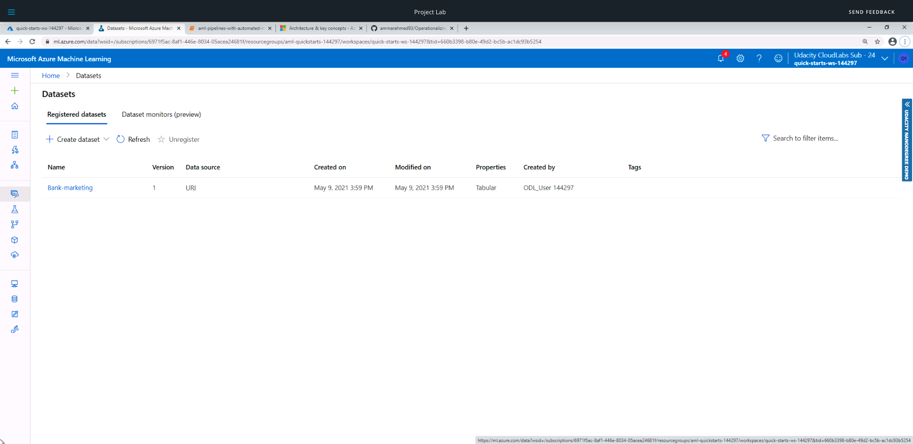
After that a new compute cluster was setup using the _Standard_DS12_v2_ selection.  Then the AutoML experiment was create with the selections as shown in the screenshot below:
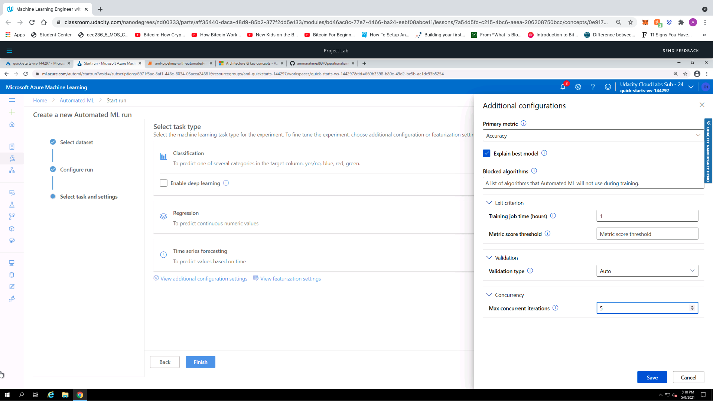
The experiment runs for about 15 mins and then once it was completed the best model was selected for deployment:
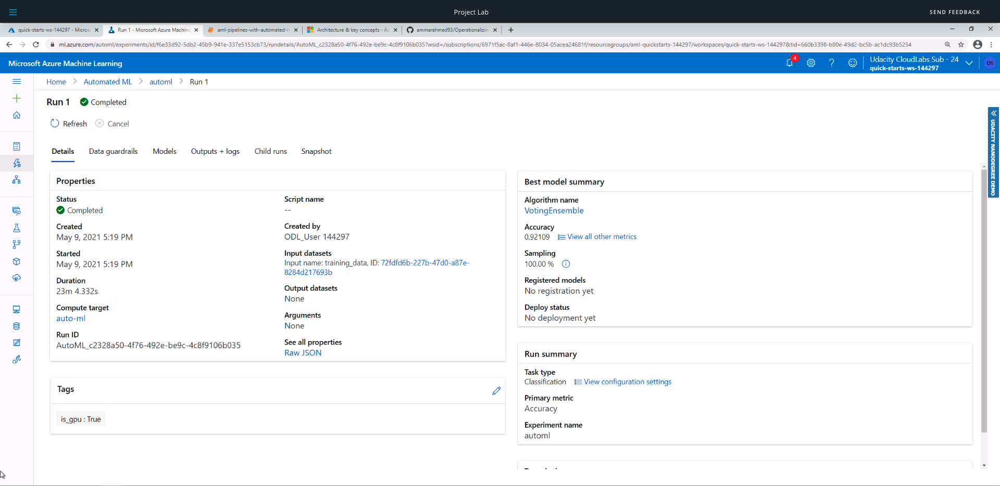
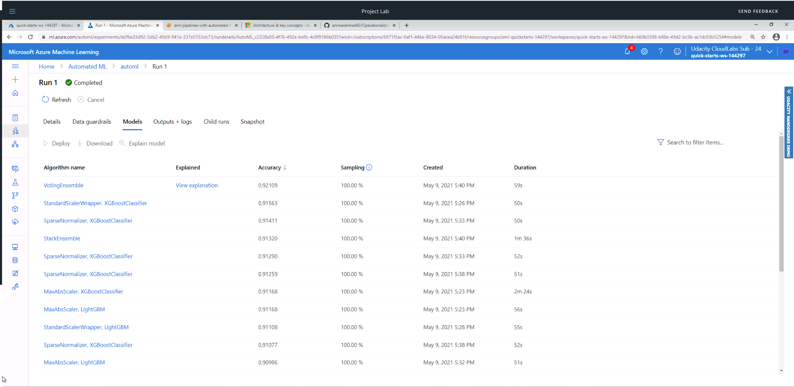

### **Deploying the best model**
After the experiment run was completed, the best model _VotingEnsemble_ was deployed using Azure Container Instance (ACI). Deploying the model in Azure allows us to interact with the HTTP API service and interact with the model by sending data over  POST request. 


### **Enable Logging**
Although it was possible to enable application insights at deplot time with a check-box, it is useful to be able to run a code that will enable it for us. The [logs.py](logs.py) was used to enable the application insights, however, we have to download the _config.json_ file from ML studio and place it within the same directory as logs.py before runing the python script. The following screenshots shows the output after runing logs.py the application insights on ML studio is enabled. 
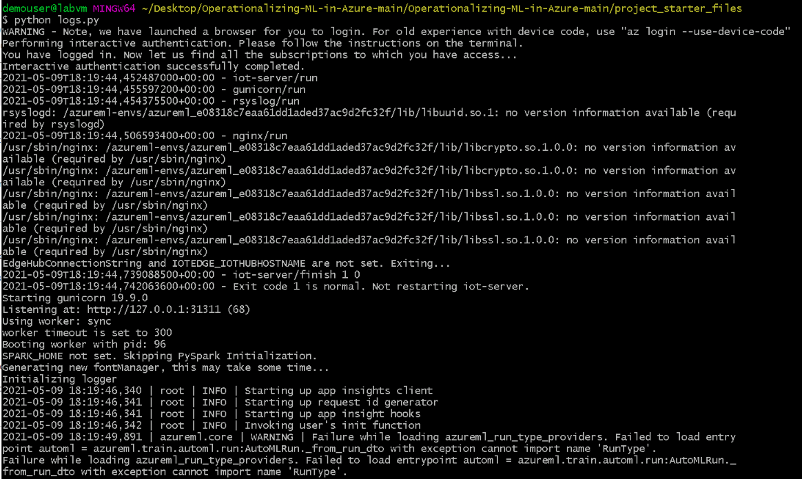
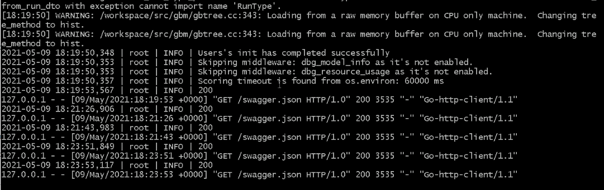
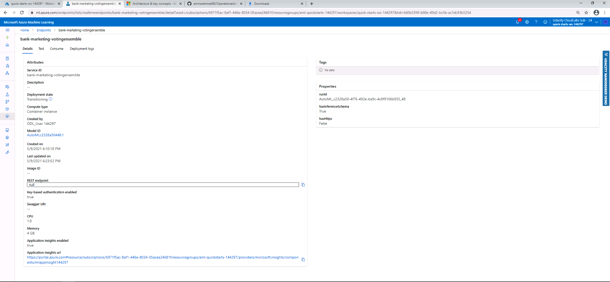
Homepage of the application insights where it shows different metrics such as failed requests, server response time...etc:
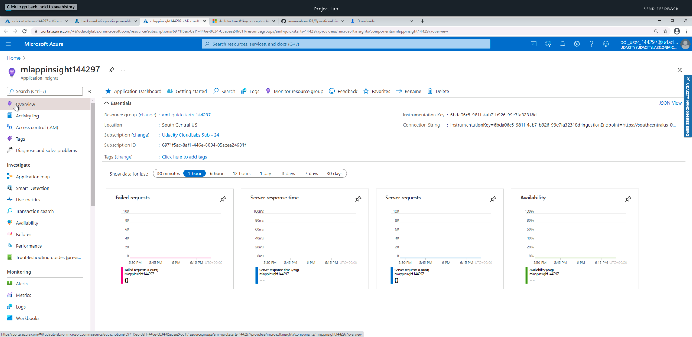

### **Swagger Documentation**
In this step, we consume the deployed model using Swagger. Azure provides a Swagger JSON link which can be downloaded through _curl_ or _wget_. Once the swagger.json was downloaded it was placed within the same directory "swagger". Running [```swagger.sh```](swagger.sh) will download the latest swagger container and it will run it on port 80. After that, the [```serve.py```](serve.py) script was run which starts a python server on port 8000. 
Opening the brower and going to the localhost:9000 will open up the swagger sample. By typing _http://localhost:8000/swagger.json_ will display the contents of the API for our model:
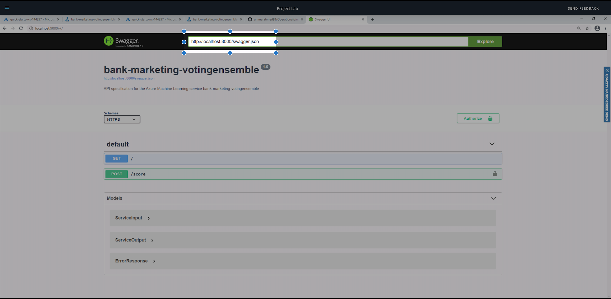
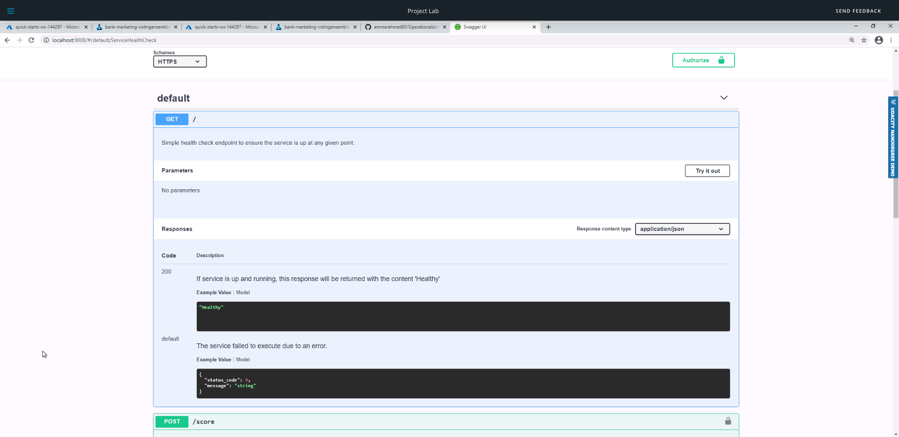
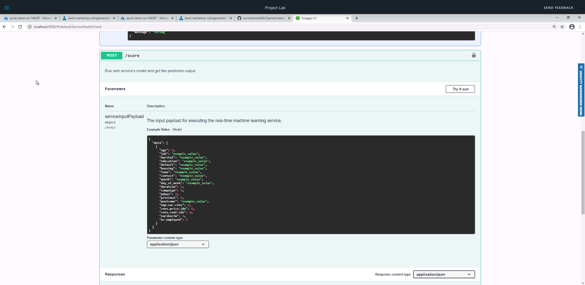

### **Consuming Model Endpoint**
To interact with the deployed model, the endpoint.py script was created. The ```scoring_uri``` and the ```key``` must match the _REST_endpoint_ and _primary key_ in the consume tab in the endpoint asset in ML studio (as shown in the screenshot below). After executing [```endpoint.py```](endpoint.py), the json output from the model was returned ```{"result": ["yes", "no"]}``` as shown below:


To benchmark the endpoint, Apache bench was used. Apache bench is an easy and popular tool for benchmarking HTTP services. 
The [```benchmark.sh```](benchmark.sh) was provided and we had to modify the ```key``` and the ```scoring_uri```.  The  script ```benchmark.sh``` doesn't have much code, however, the Apache Benchmark (ab) command line tool must be installed. The script will run 10 requests ```-n 10``` and the verbosity was set to 4 ```-v 4```. The script uses ```data.json``` which was saved from the output ```endpoint.py``` and the ```-T 'application/json``` spcifies that its sending it a json application. The result as shown in the screenshot below: 


### **Creating, publishing, and Consuming a pipeline**


### **Documentation**


## Screen Recording
*TODO* Provide a link to a screen recording of the project in action. Remember that the screencast should demonstrate:


## Future work


## References

